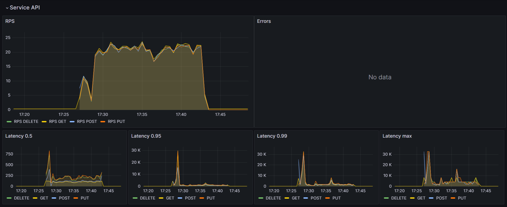
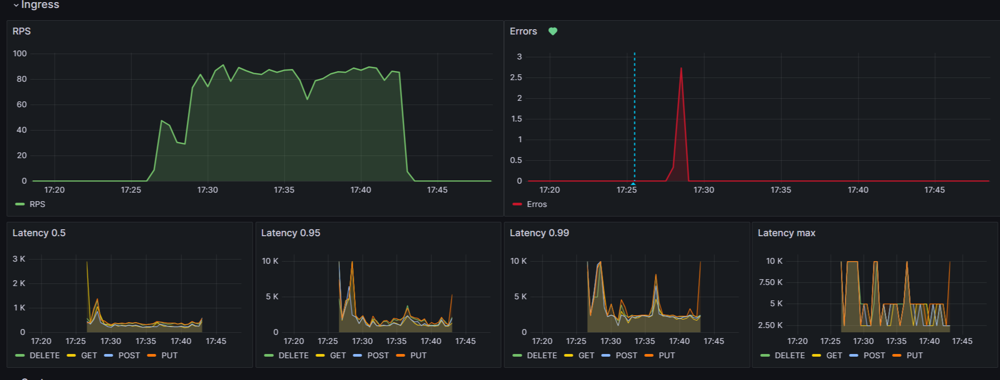
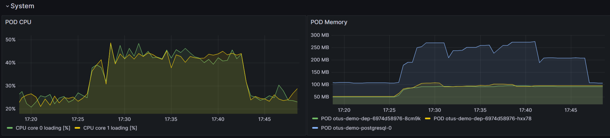
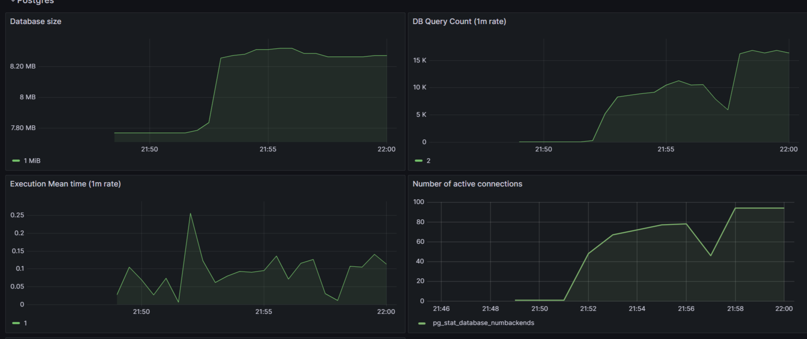

# Prometheus. Grafana (Домашнее задание)

## Установка 

Необходимо запустить скрипт `install.sh`

Прокидование портов 

```shell
 kubectl port-forward service/prom-grafana 9000:80
 kubectl port-forward service/prom-kube-prometheus-stack-prometheus 9090
```
Учетная запись grafana `admin prom-operator`

## Графана

### Dashboard

Файл с dashboard лежит [здесь](grafana/dashboard.json)
Так же добавлены алерты на необходимые метрики.

### Метрики User Service

   

### Метрики Inginx контроллера

   

### Потребление памяти и CPU

   

### Метрики Postgres

   


## Тестирование

Тесты лежат в папке `test`

```shell
newman run tests/users.json
```

В папке `perfomance` лежит скрипт для нагрузочного тестирования CRUD операций с помощью [locust](https://docs.locust.io/en/stable/quickstart.html)

```shell
locust -f perfomance/users.py --headless --users 30 --spawn-rate 1 -H http://arch.homework/otusapp
```

## Полезное 

1. Метрики postgres доступны на порту 9187 пример: `curl http://10.244.0.125:9187/metrics`

