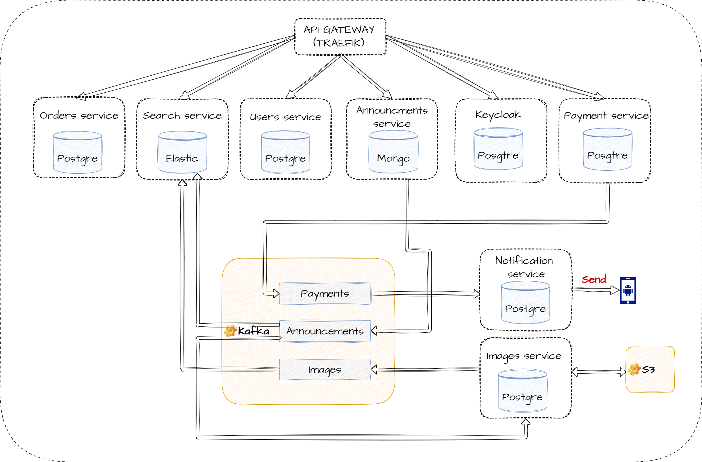

# Паттерны декомпозиции микросервисов (Сервис по размещению объявлений)

## Пользовательские сценарии

### Как неавторизованный пользователь я могу

* зарегистрироваться
* войти в свою учетную запись
* выполнить поиск объявление по заданным критериям
* просмотреть карточку объявления

### Как авторизованный пользователь я могу

* выполнить выход из учетной записи
* внести изменения в свою учетную запись
* добавить/изменить/удалить объявление вместе с описанием и изображеними
* увидеть список своих объявлений
* выполнить поиск объявление по заданным критериям
* купить продвижение своего объявления
* увидеть список своих покупок
* получать уведомления на телефон через push или sms
* просмотреть карточку объявления

### Как администратор я могу

* заблокировать любого пользователя
* заблокировать любое объявление

## Контракты

## Объявление

Сущность `объявление` содержит следующие поля

* Идентификатор
* Заголовок
* Описание
* Цена
* Атрибуты
* Адрес
* Контакты
* Массив изображений

## Пользователь

Сущность `пользователь` содержит следующие поля

* Идентификатор
* Фамилия
* Имя
* Дата рождения
* Пол
* Телефон

## Заказ

Сущность `заказ` содержит следующие поля

* Идентификатор
* Тип продвижения
* Массив объявлений
* Период действия
* Стоимость
* Состояние

## Схема взаимодействия сервисов

Для упрощения на данной схеме не отображены синхронные вызовы.

## Описание сервисов

* Auth service (Keycloack)

Выполняет регистрацию, аутентификацию и авторизацию пользователей. Для уменьшения затрат на разработку может быть использовано коробочное решение на основе IdentityServer или Keycloak.

* Users service

Осуществляет управление (создание, редактирование) данными которые относятся к персональным данным пользователя (профайл, биометрия и т.д.). Для хранения этих данных предъявляются отдельные требования по обсепечению безопасности, а так же по законам РФ запрещена трансграничная передача.

* Announcements service

Осуществляет управление данными которые относятся к объявлениям. Данные могу передаваться отдельными сущностями через HTTP запросы или же через загрузку файлов специального формата (xml, json). После добавления\изменения объявления публикует отчетное событие в Kafka. Данные по обхъявлениям рекомендуется хранить в документно-оринетированной БД. Предполагается использовать MongoDB.

* Payment service

Осуществляет взаимодейтсвия с платежным шлюзом банка. После обработки платежа публикует отчетное событие в Kafka.

* Notification service

Осуществляет отправку SMS, push, Email уведомлений согласно бизнесс логики. Данные для боработки получает из Kafka.

* Order service

Осуществляет управление данными которые относятся к заказам.

* Search service

Формирует поисковую выдачу по объявлениям на основании запроса от пользователя. Для реализации гибкого поиска рекомендуется использовать ElasticSearch. Сервис аккумулирует в себя большой объем бизнесс правил по ранжированию объявлений в зависимости от разных критериев. (к примеру платное продвижение объявление, местоположение пользователя и т.д). Данные для заполнения собственной БД берутся из Kafka из топика Announcements.

* Images service

Осуществляет обработку изображений из объявлений (поворот, формирование несколько видов превью) и выкладку их на CDN в S3 хранилище. Данные для заполнения собственной БД берутся из Kafka из топика Announcements. После обработки изображения публикует отчетное событие в Kafka.

* API gateway

Ответственен за роутинг запросов к сервисам
