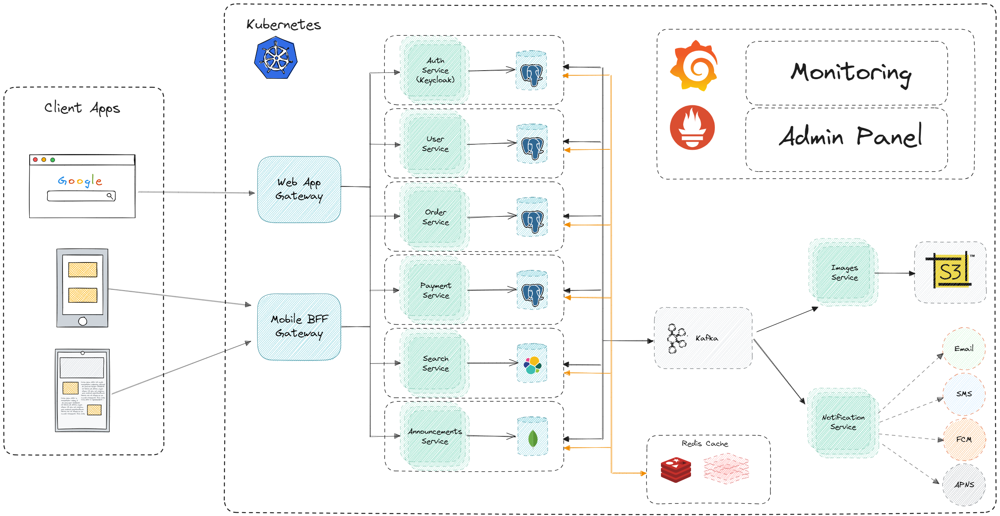
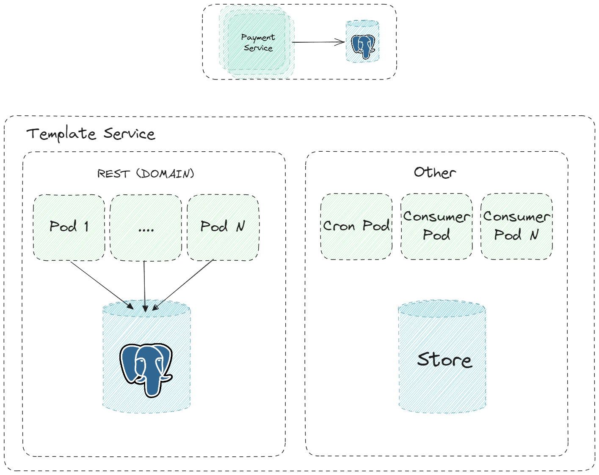

# Проектная работа

## Тема: Интернет-сервис для размещения объявлений

## Теоретическая часть

Спроектировать архитектуру. Декомпозировать архитектуру на микросервисы.

  

Архитектура шаблона для микросервиса

  

### Используемые технологии

Система разворачивается в среде `Kubernetes`. Данные по работоспособности системы отправляются в `Prometheus`. На основе этих данных строятся графики в `Grafana` с возможностью настроить оповещения о критических событиях в системе.

В качесте основной платформы разработки выбрана платформа `.net`. Текущая версия 7.0, с выходом версии 8.0 рекомендуется обновление.

Основной СУБД для системы является `PostgreSQL`. Так же в проекте предполагается использование `MongoDb` и `ElasticSearch`.

В качестве шины данных используется `Kafka` так как позволяет достичь высокой скорости обработки данных.

Для хранения кеша используется `Redis`.

### Описание сервисов

* Auth service (Keycloack)

Выполняет регистрацию, аутентификацию и авторизацию пользователей. Для уменьшения затрат на разработку может быть использовано коробочное решение на основе IdentityServer или Keycloak.

* Users service

Осуществляет управление (создание, редактирование) данными которые относятся к персональным данным пользователя (профайл, биометрия и т.д.). Для хранения этих данных предъявляются отдельные требования по обсепечению безопасности, а так же по законам РФ запрещена трансграничная передача.

* Announcements service

Осуществляет управление данными которые относятся к объявлениям. Данные могу передаваться отдельными сущностями через HTTP запросы или же через загрузку файлов специального формата (xml, json). После добавления\изменения объявления публикует отчетное событие в Kafka. Данные по объявлениям рекомендуется хранить в документно-оринетированной БД. Предполагается использовать MongoDB.

* Payment service

Осуществляет взаимодейтсвия с платежным шлюзом банка. После обработки платежа публикует отчетное событие в Kafka.

* Notification service

Осуществляет отправку SMS, push, Email уведомлений согласно бизнесс логики. Данные для боработки получает из Kafka.

* Order service

Осуществляет управление данными которые относятся к заказам.

* Search service

Формирует поисковую выдачу по объявлениям на основании запроса от пользователя. Для реализации гибкого поиска рекомендуется использовать ElasticSearch. Сервис аккумулирует в себя большой объем бизнесс правил по ранжированию объявлений в зависимости от разных критериев. (к примеру платное продвижение объявление, местоположение пользователя и т.д). Данные для заполнения собственной БД берутся из Kafka из топика Announcements.

* Images service

Осуществляет обработку изображений из объявлений (поворот, формирование несколько видов превью) и выкладку их на CDN в S3 хранилище. Данные для заполнения собственной БД берутся из Kafka из топика Announcements. После обработки изображения публикует отчетное событие в Kafka.

* Web gateway / Mobile BFF gateway

Ответственен за роутинг запросов к сервисам. Основная задача состоит в том чтобы подготовить данные для клинетов согласно внешним интерфейсам.

## Установка

Необходимо запустить скрипт `install.sh`

## Тестирование

Тесты лежат в папке `test`

```shell
newman run tests/project.json
```
